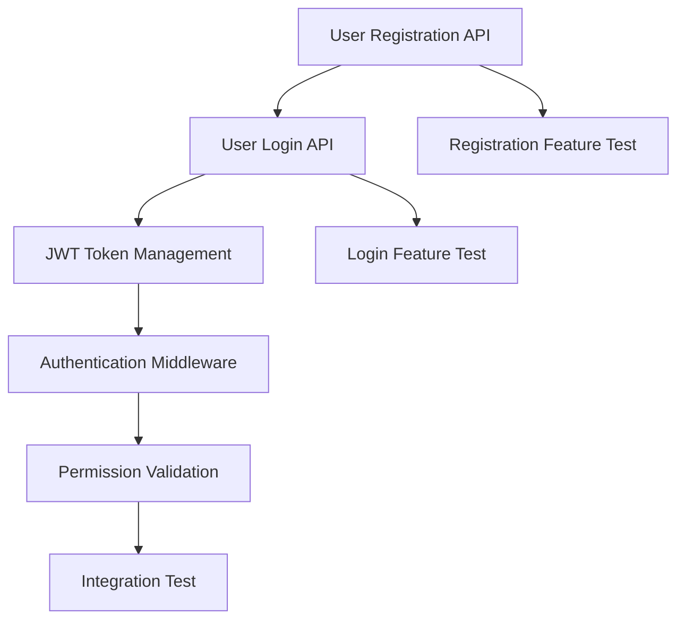

# m-task-planner - Development Task Planning Workflow

## Overview

`m-task-planner` is an intelligent requirements analysis and task planning tool that transforms complex requirements documents into structured implementation plans. By analyzing requirements, designing architecture, decomposing tasks, and mapping dependencies, this command provides a clear execution path for development teams.

## Usage

```bash
/m-task-planner [target]
```

## Parameter Details

- `target` (optional): The target requirements document or project scope.
  - **Default Behavior**: Automatically discovers requirements documents in the project.
  - **Supported Formats**: Markdown files, requirements documents, project descriptions.
  - **Examples**: `requirements.md`, `specs/`, `"Implement user management system"`.

## Usage Examples

### Plan Based on Requirements Document
```bash
/m-task-planner requirements.md
```
**Expected Outcome**:
- Parses the content of the requirements document.
- Extracts functional and technical requirements.
- Generates a structured task plan.
- Creates a dependency diagram.

### Plan Based on Project Description
```bash
/m-task-planner "Implement e-commerce platform user authentication and payment system"
```
**Expected Outcome**:
- Analyzes the project description.
- Identifies core functional modules.
- Designs an implementation strategy.
- Generates a detailed task list.

### Auto-Discovery Mode
```bash
/m-task-planner
```
**Expected Outcome**:
- Scans the project directory for requirements documents.
- Analyzes the existing code structure.
- Identifies features to be implemented.
- Generates a supplementary development plan.

### Plan for a Directory Scope
```bash
/m-task-planner specs/
```
**Expected Outcome**:
- Scans the entire `specs` directory.
- Merges multiple requirements documents.
- Generates a unified implementation plan.
- Handles dependencies between requirements.

## Workflow

### 1. Requirements Analysis
- **Document Parsing**: Extracts functional requirements and technical constraints.
- **Requirement Classification**: Differentiates between core features, auxiliary features, and non-functional requirements.
- **Ambiguity Identification**: Flags unclear or ambiguous requirements for clarification.
- **Priority Assessment**: Assesses priority based on business value and technical complexity.

### 2. Implementation Strategy Design
- **Architecture Planning**: Defines the system architecture and design patterns.
- **Technology Selection**: Chooses the appropriate technology stack and tools.
- **API Design**: Plans the interface structure and data models.
- **Test Strategy**: Determines the testing methods and coverage targets.

### 3. Task Decomposition
- **Feature Breakdown**: Decomposes complex features into small, achievable tasks.
- **Test Tasks**: Creates corresponding test tasks for each feature.
- **Task Classification**: Marks task types (feature, test, refactor, docs).
- **Workload Estimation**: Estimates the development time for each task.

### 4. Dependency Mapping
- **Prerequisites**: Identifies the prerequisites for each task.
- **Blocking Relationships**: Marks blocking dependencies between tasks.
- **Parallel Opportunities**: Identifies tasks that can be developed in parallel.
- **Critical Path**: Determines the project's critical path and milestones.

### 5. Plan Visualization
- **Mermaid Diagram**: Generates a task flow diagram.
- **Dependency Graph**: Shows dependencies between tasks.
- **Timeline**: Displays the project execution timeline.
- **Milestones**: Marks important project milestones.

### 6. Report Generation
- **Bilingual Report**: Generates a task plan in both English and Chinese.
- **JSON Format**: Provides machine-readable task data.
- **File Saving**: Saves the report to the `docs/workspaces/` directory.
- **Version Control**: Supports version management of the plan.

## Task Type Classification

### Feature Development Tasks
- **Frontend Development**: UI components, page development.
- **Backend Development**: API interfaces, business logic.
- **Database**: Data models, migration scripts.
- **Integration**: Third-party service integration.

### Test Tasks
- **Unit Tests**: Function-level tests.
- **Integration Tests**: Integration tests between modules.
- **End-to-End Tests**: User scenario tests.
- **Performance Tests**: Load and stress tests.

### Support Tasks
- **Refactoring**: Code quality improvements.
- **Documentation**: Technical documentation writing.
- **Configuration**: Environment configuration and deployment.
- **Monitoring**: Logging and monitoring setup.

## Expected Outcomes

### Task Plan Report
```markdown
# Task Plan Report - User Authentication System
Generated At: 2025-01-15 14:30:00
Project Scope: User authentication and permission management

## Overview
- Implementation Strategy: Microservices architecture + JWT authentication
- Testing Method: TDD + Integration testing
- Key Technologies: Node.js + Express + MongoDB

## Task List (15 tasks)

### Core Feature Tasks
1. **User Registration API** (task_001)
   - Type: Feature Development
   - Status: Pending
   - Workload: 4 hours
   - Dependencies: None

2. **User Login API** (task_002)
   - Type: Feature Development
   - Status: Pending
   - Workload: 3 hours
   - Dependencies: task_001

3. **JWT Token Management** (task_003)
   - Type: Feature Development
   - Status: Pending
   - Workload: 5 hours
   - Dependencies: task_002

### Test Tasks
4. **Registration Feature Test** (task_004)
   - Type: Unit Test
   - Status: Pending
   - Workload: 2 hours
   - Dependencies: task_001

5. **Login Feature Test** (task_005)
   - Type: Unit Test
   - Status: Pending
   - Workload: 2 hours
   - Dependencies: task_002

## Dependency Diagram


## Milestone Plan
- Week 1: Complete user registration and login features.
- Week 2: Complete JWT token management and permission validation.
- Week 3: Complete all tests and documentation.
- Week 4: Integration testing and deployment preparation.

## Clarification Questions
1. What are the password complexity requirements?
2. Is third-party login support required?
3. What is the session timeout setting?
4. What is the required granularity for the permission system?
```

### JSON Format Task Data
```json
{
  "project": "User Authentication System",
  "generated_at": "2025-01-15T14:30:00Z",
  "overview": {
    "architecture": "Microservices architecture",
    "technology_stack": ["Node.js", "Express", "MongoDB"],
    "testing_approach": "TDD + Integration testing",
    "estimated_duration": "4 weeks"
  },
  "tasks": [
    {
      "id": "task_001",
      "description": "Implement user registration API",
      "type": "feature",
      "status": "pending",
      "estimated_hours": 4,
      "dependencies": [],
      "priority": "high"
    },
    {
      "id": "task_002", 
      "description": "Implement user login API",
      "type": "feature",
      "status": "pending",
      "estimated_hours": 3,
      "dependencies": ["task_001"],
      "priority": "high"
    }
  ],
  "clarifications": [
    {
      "question": "What are the password complexity requirements?",
      "category": "security",
      "priority": "high"
    },
    {
      "question": "Is third-party login support required?",
      "category": "feature",
      "priority": "medium"
    }
  ]
}
```

## Best Practices

### 1. Requirements Analysis
- **Completeness Check**: Ensure all requirements are covered.
- **Testability**: Each requirement should be testable.
- **Feasibility**: Assess the feasibility of technical implementation.
- **Priority Balancing**: Balance business value and technical complexity.

### 2. Task Decomposition
- **Single Responsibility**: Each task should solve a single problem.
- **Reasonable Granularity**: Tasks should not be too large (>1 day) or too small (<2 hours).
- **Testable**: Each task should have clear completion criteria.
- **Parallelizable**: Create tasks that can be executed in parallel whenever possible.

### 3. Dependency Management
- **Minimal Dependencies**: Reduce unnecessary task dependencies.
- **Clear Definitions**: Clearly define the specifics of dependencies.
- **Risk Identification**: Identify key dependencies that may affect the schedule.
- **Flexible Adjustments**: Support dynamic adjustment of dependencies.

### 4. Plan Maintenance
- **Regular Updates**: Update the plan according to actual progress.
- **Feedback Loop**: Collect execution feedback and optimize the plan.
- **Version Management**: Save historical versions of the plan.
- **Team Collaboration**: Ensure team members understand the plan.

## Configuration Options

### Task Decomposition Granularity
```yaml
task_granularity:
  min_hours: 2        # Minimum task duration
  max_hours: 8        # Maximum task duration
  default_hours: 4    # Default task duration
```

### Report Format
```yaml
report_format:
  language: "bilingual"    # Bilingual report
  include_json: true       # Include JSON format
  include_diagram: true    # Include dependency diagram
  save_location: "docs/workspaces/"
```

## Output Files

### File Naming Format
```
docs/workspaces/task-plan-MM-dd-HH-mm-ss.md
```

### File Content Structure
- **English Report**: Overview, tasks, diagram, clarification questions.
- **Chinese Report**: Corresponding Chinese version.
- **JSON Data**: Machine-readable task data.

## Related Commands

- [`m-orchestrated-dev`](m-orchestrated-dev.md) - Multi-Agent Development
- [`m-tdd-planner`](m-tdd-planner.md) - TDD Planning
- [`m-next-task`](m-next-task.md) - Next Task Analysis
- [`m-review-code`](m-review-code.md) - Code Review
