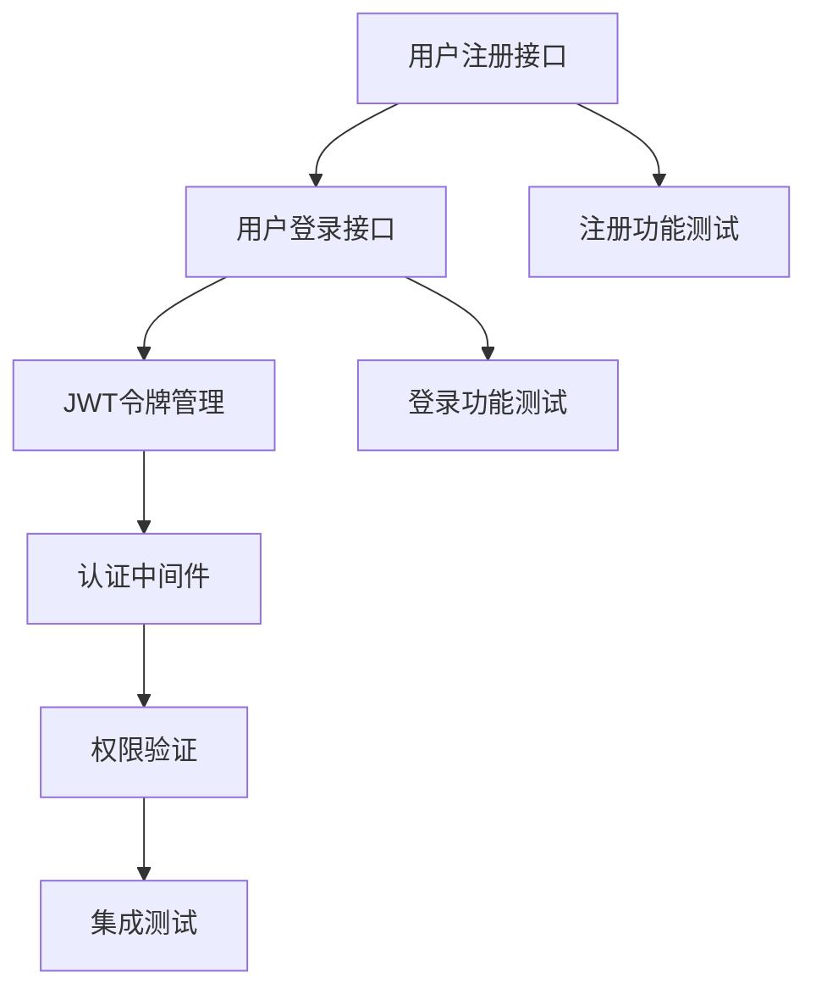

# m-task-planner - 开发任务规划工作流

## 概述

`m-task-planner` 是一个智能的需求分析和任务规划工具，能够将复杂的需求文档转换为结构化的实施计划。该命令通过分析需求、设计架构、分解任务和映射依赖关系，为开发团队提供清晰的执行路径。

## 使用方法

```bash
/m-task-planner [target]
```

## 参数详解

- `target` (可选): 目标需求文档或项目范围
  - 默认行为: 自动发现项目中的需求文档
  - 支持格式: Markdown文件、需求文档、项目描述
  - 示例: `requirements.md`, `specs/`, `"实现用户管理系统"`

## 使用示例

### 基于需求文档规划
```bash
/m-task-planner requirements.md
```
**预期结果**: 
- 解析需求文档内容
- 提取功能和技术需求
- 生成结构化任务计划
- 创建依赖关系图

### 基于项目描述规划
```bash
/m-task-planner "实现电商平台用户认证和支付系统"
```
**预期结果**: 
- 分析项目描述
- 识别核心功能模块
- 设计实施策略
- 生成详细任务清单

### 自动发现模式
```bash
/m-task-planner
```
**预期结果**: 
- 扫描项目目录寻找需求文档
- 分析现有代码结构
- 识别待实现功能
- 生成补充开发计划

### 目录范围规划
```bash
/m-task-planner specs/
```
**预期结果**: 
- 扫描整个 specs 目录
- 合并多个需求文档
- 生成统一的实施计划
- 处理需求间的依赖关系

## 工作流程

### 1. 需求分析
- **文档解析**: 提取功能需求和技术约束
- **需求分类**: 区分核心功能、辅助功能和非功能需求
- **模糊识别**: 标记不明确或需要澄清的需求
- **优先级评估**: 根据业务价值和技术复杂度评估优先级

### 2. 实施策略设计
- **架构规划**: 定义系统架构和设计模式
- **技术选型**: 选择合适的技术栈和工具
- **API设计**: 规划接口结构和数据模型
- **测试策略**: 确定测试方法和覆盖目标

### 3. 任务分解
- **功能拆解**: 将复杂功能分解为可实现的小任务
- **测试任务**: 为每个功能创建对应的测试任务
- **任务分类**: 标记任务类型（功能、测试、重构、文档）
- **工作量评估**: 预估每个任务的开发时间

### 4. 依赖关系映射
- **前置条件**: 识别任务的前置要求
- **阻塞关系**: 标记任务间的阻塞依赖
- **并行机会**: 识别可以并行开发的任务
- **关键路径**: 确定项目的关键路径和里程碑

### 5. 计划可视化
- **Mermaid图表**: 生成任务流程图
- **依赖图**: 显示任务间的依赖关系
- **时间线**: 展示项目执行时间线
- **里程碑**: 标记重要的项目节点

### 6. 报告生成
- **双语报告**: 生成中英文对照的任务计划
- **JSON格式**: 提供机器可读的任务数据
- **文件保存**: 保存到 `docs/workspaces/` 目录
- **版本控制**: 支持计划的版本管理

## 任务类型分类

### 功能开发任务
- **前端开发**: UI组件、页面开发
- **后端开发**: API接口、业务逻辑
- **数据库**: 数据模型、迁移脚本
- **集成**: 第三方服务集成

### 测试任务
- **单元测试**: 函数级别的测试
- **集成测试**: 模块间的集成测试
- **端到端测试**: 用户场景测试
- **性能测试**: 负载和压力测试

### 支持任务
- **重构**: 代码质量改进
- **文档**: 技术文档编写
- **配置**: 环境配置和部署
- **监控**: 日志和监控设置

## 预期结果

### 任务计划报告
```markdown
# 任务计划报告 - 用户认证系统
生成时间: 2025-01-15 14:30:00
项目范围: 用户认证和权限管理

## 概述
- 实施策略: 微服务架构 + JWT认证
- 测试方法: TDD + 集成测试
- 关键技术: Node.js + Express + MongoDB

## 任务清单 (15个任务)

### 核心功能任务
1. **用户注册接口** (task_001)
   - 类型: 功能开发
   - 状态: 待开始
   - 工作量: 4小时
   - 依赖: 无

2. **用户登录接口** (task_002)
   - 类型: 功能开发
   - 状态: 待开始
   - 工作量: 3小时
   - 依赖: task_001

3. **JWT令牌管理** (task_003)
   - 类型: 功能开发
   - 状态: 待开始
   - 工作量: 5小时
   - 依赖: task_002

### 测试任务
4. **注册功能测试** (task_004)
   - 类型: 单元测试
   - 状态: 待开始
   - 工作量: 2小时
   - 依赖: task_001

5. **登录功能测试** (task_005)
   - 类型: 单元测试
   - 状态: 待开始
   - 工作量: 2小时
   - 依赖: task_002

## 依赖关系图


## 里程碑计划
- 第1周: 完成用户注册和登录功能
- 第2周: 完成JWT令牌管理和权限验证
- 第3周: 完成所有测试和文档
- 第4周: 集成测试和部署准备

## 待确认问题
1. 用户密码复杂度要求？
2. 是否需要支持第三方登录？
3. 会话超时时间设置？
4. 权限系统的粒度要求？
```

### JSON格式任务数据
```json
{
  "project": "用户认证系统",
  "generated_at": "2025-01-15T14:30:00Z",
  "overview": {
    "architecture": "微服务架构",
    "technology_stack": ["Node.js", "Express", "MongoDB"],
    "testing_approach": "TDD + 集成测试",
    "estimated_duration": "4周"
  },
  "tasks": [
    {
      "id": "task_001",
      "description": "实现用户注册接口",
      "type": "feature",
      "status": "pending",
      "estimated_hours": 4,
      "dependencies": [],
      "priority": "high"
    },
    {
      "id": "task_002", 
      "description": "实现用户登录接口",
      "type": "feature",
      "status": "pending",
      "estimated_hours": 3,
      "dependencies": ["task_001"],
      "priority": "high"
    }
  ],
  "clarifications": [
    {
      "question": "用户密码复杂度要求？",
      "category": "security",
      "priority": "high"
    },
    {
      "question": "是否需要支持第三方登录？",
      "category": "feature",
      "priority": "medium"
    }
  ]
}
```

## 最佳实践

### 1. 需求分析
- **完整性检查**: 确保所有需求都被覆盖
- **可测试性**: 每个需求都应该是可测试的
- **可实现性**: 评估技术实现的可行性
- **优先级平衡**: 平衡业务价值和技术复杂度

### 2. 任务分解
- **单一职责**: 每个任务只解决一个问题
- **合理粒度**: 任务不应太大（>1天）或太小（<2小时）
- **可测试**: 每个任务都有明确的完成标准
- **可并行**: 尽可能创建可并行执行的任务

### 3. 依赖管理
- **最小依赖**: 减少不必要的任务依赖
- **清晰定义**: 明确依赖关系的具体内容
- **风险识别**: 识别可能影响进度的关键依赖
- **灵活调整**: 支持依赖关系的动态调整

### 4. 计划维护
- **定期更新**: 根据实际进度更新计划
- **反馈循环**: 收集执行反馈并优化计划
- **版本管理**: 保存计划的历史版本
- **团队协作**: 确保团队成员理解计划

## 配置选项

### 任务分解粒度
```yaml
task_granularity:
  min_hours: 2        # 最小任务时间
  max_hours: 8        # 最大任务时间
  default_hours: 4    # 默认任务时间
```

### 报告格式
```yaml
report_format:
  language: "bilingual"    # 双语报告
  include_json: true       # 包含JSON格式
  include_diagram: true    # 包含依赖图
  save_location: "docs/workspaces/"
```

## 输出文件

### 文件命名格式
```
docs/workspaces/task-plan-MM-dd-HH-mm-ss.md
```

### 文件内容结构
- **英文报告**: 概述、任务、图表、澄清问题
- **中文报告**: 对应的中文版本
- **JSON数据**: 机器可读的任务数据

## 相关命令

- [`m-orchestrated-dev`](m-orchestrated-dev.md) - 多智能体开发
- [`m-tdd-planner`](m-tdd-planner.md) - TDD规划
- [`m-next-task`](m-next-task.md) - 下一步任务分析
- [`m-review-code`](m-review-code.md) - 代码审查